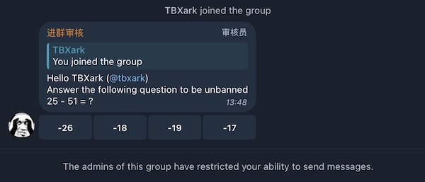

# telegram-verification-workers

**telegram-verification-workers** is a telegram bot worker that helps you to verify the user's join request in the telegram **supergroup**.

## Development kit

- [**telegram-router**](https://github.com/TBXark/telegram-router): A simple javascript library that helps you to route messages from telegram bot to your application.
- [**telegram-bot-api-types**](https://github.com/TBXark/telegram-bot-api-types): Telegram Bot API SDK compiled size is 0KB that only includes type definition files and jsdoc files.
- [**telegram-bot-workers-template**](https://github.com/TBXark/telegram-bot-workers-template): A simple template for creating telegram bot workers.
- [**cloudflare-worker-adapter**](https://github.com/TBXark/cloudflare-worker-adapter): Run your script without Cloudflare Workers.

## LICENSE

**telegram-verification-workers** is released under the MIT license. [See LICENSE](LICENSE) for details.
